See the ad we made for it :

<!-- <iframe src="youtube.com"> -->

### Translations available :
- [English](#en)
* [Français](#fr)
# <a id="en">English Version</a>

**HypLoad** is a smart software made to download audio/video from YouTube <u>videos</u> & <u>playlists</u>. Available on Windows, macOS et Linux. 
Acts as a clean GUI for [yt-dlp](https://github.com/yt-dlp/yt-dlp).
> Hypload will always be entirely free, ad-less or virus, and doesn't need an account.

### Summary
- [Installation](#en-installation)
   - [Windows](#en-win)
   - [macOS](#en-mac)
   - [Source code](#en-source-code)
   <!-- - [Linux](#) -->
- [Hypload Features](#en-features)
   - [Download a video](#en-download-video)
   - [Download a playlist](#en-download-playlist)
   - [Load saved playlists](#en-load-playlist)
   - [Video resolutions](#en-resolution)
   - [Updating HypLoad](#en-update)
- [Screenshots](#en-screenshots)
- [Licence](LICENCE)

## <a id="en-installation">Installation</a>

- [Windows](#en-win)
- [macOS](#en-mac)
- [Code source](#en-source-code)

### <a id="en-win">Windows</a>

1. Download the <a href="https://github.com/Hypocrate-code/HypLoad/raw/refs/heads/main/out/make/squirrel.windows/x64/HypLoad-1.0.0%20Setup.exe?download=">HypLoad-Setup.exe</a> file of the pre-release.
2. Execute <u>HypLoad-Setup.exe</u> and accept permissions.
3. Use HypLoad !

Downloads will be available in [these folders](#en-folders).

See [Features](#en-features).

### <a id="en-mac">macOS</a>

1. Download the <a href="https://github.com/Hypocrate-code/HypLoad/raw/refs/heads/main/out/make/HypLoad-1.0.0-arm64.dmg?download=">.dmg</a> file of the latest release.
2. Execute <u>HypLoad-x.x.x-arm64.dmg</u>.
3. Place HypLoad in the */Applications* folder.
4. Open a terminal and execute `sudo xattr -r -d com.apple.quarantine /Applications/HypLoad.app` to authorize HypLoad on your mac.
5. Use HypLoad !

Downloads will be available in [these folders](#en-folders).

See [Features](#en-features).

### <a id="en-source-code">Source code</a>

**Prerequisites :** [Git](https://git-scm.com/), [Node.js](https://nodejs.org/en) and [npm](https://www.npmjs.com/) have to be installed on your PC.

1. `git clone https://github.com/Hypocrate-code/HypLoad`
2. `cd Hypload/`
3. `npm install`
4. Install the corresponding [ffmpeg](https://ffmpeg.org/) and [yt-dlp](https://github.com/yt-dlp/yt-dlp?tab=readme-ov-file#release-files) executables according to your OS, then place them in Hypload/bin/mac or Hypload/bin/win.
5. `npm run start`

## <a id="en-features">HypLoad Features</a>

- [Download a video](#en-download-video)
- [Download a playlist](en-download-playlist)
- [Load saved playlists](en-load-playlist)
- [Video resolutions](en-resolution)
- [Update HypLoad](en-update)

### <a id="en-download-video">Download a video</a>

1. Copy your YouTube video's link (Share + Copy).
2. Click on "Download a video" on HypLoad and paste the lien.
3. Check that you agree with the downloading option : "Audio only" to download a .mp3 file, or "Audio and Video" for a .mp4 one, otherwise click it.
4. Click on "Download".

Downloads will be available in [these folders](#en-folders).

### <a id="en-download-playlist">Download a playlist</a>

To download a whole playlist :

1. Copy your YouTube playlist's link (Share + Copy).
2. Click on "Download a playlist" on HypLoad and paste the link.
3. Check that you agree with the downloading option : "Audio only" to download a .mp3 file, or "Audio and Video" for a .mp4 one, otherwise click it.
4. Click on "Validate".

Once the playlist is loaded, each video has an "Audio only"  or "Audio and Video"  option ; as well as a box checked  or not , indicating whether the video should be downloaded. Click one of them to invert its state.

If the video is already in its [downloading folder](#en-folders), its box will be **unchecked by default** so as not to download it again.
This allows you to update a playlist already downloaded without having to sort its elements.

HypLoad saves your playlist's link in the section [My saved playlists](#en-load-playlist).

### <a id="en-load-playlist">Load saved playlists</a>

HypLoad saves your playlist's links for you to load them easily and download only the new elements.
1. Click on "My playlists saved".
2. If you've already loaded some, click on the one you want to reload.
3. Its link is then pasted in [Download a playlist](#en-download-playlist).

### <a id="en-resolution">Video resolutions</a>

The **Audio and Video** option will download the video's sound and images.
You can choose the resolution you want your video to be downloaded in, go to "Options and infos" &rarr; "Video resolutions".

You can choose between :
- Highest available
- 1080p
- 720p
- 480p
- 360p
- 240p
- 144p
- Lowest available

### <a id="en-update">Update HypLoad</a>

Because YouTube's algorithm changes regularly, HypLoad has to be frequently updated. 
**The auto-update feature of HypLoad is not available yet** : if HypLoad doesn't work anymore, please retry with [the latest release](https://github.com/Hypocrate-code/HypLoad/releases), or report it.

## <a id="en-folders">Download folders</a>

- [Windows](#en-win-folders)
- [macOS](#en-mac-folders)

### <a id="en-win-folders">Windows</a>

- "Audio only" option &rarr; folder /HypLoad at C:/Users/yourName/Music/, or **Win + R + "Music"**
- "Audio and Video" option &rarr; folder /HypLoad at C:/Users/yourName/Videos/, or **Win + R + "Videos"**

### <a id="en-mac-folders">macOS</a>

- "Audio only" option &rarr; folder /HypLoad at yourName/Music/, or **Finder + "Music" (folder with a musical note icon)**
- "Audio and Video" &rarr; folder /HypLoad at yourName/Videos/, or **Finder + "Videos" (folder with a film strip icon)**

## <a id="en-screenshots">Screenshots</a>

#### Home in Light / Dark mode

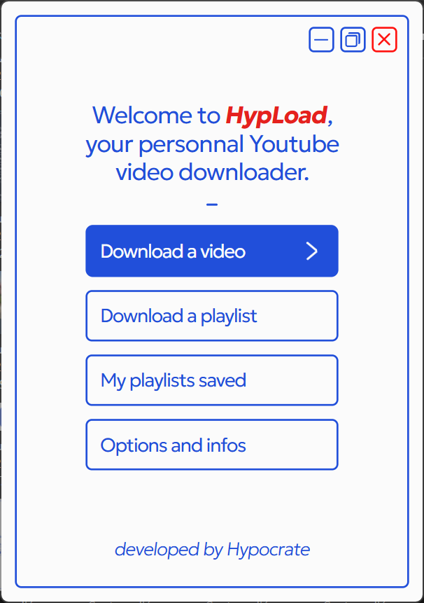
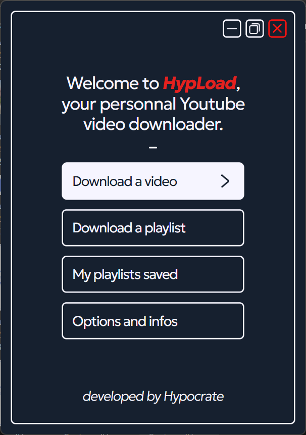

#### Download a video

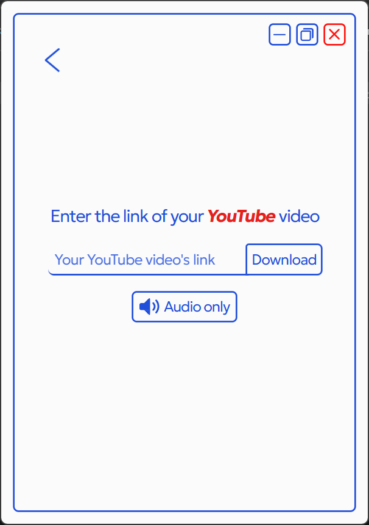

#### Download a playlist

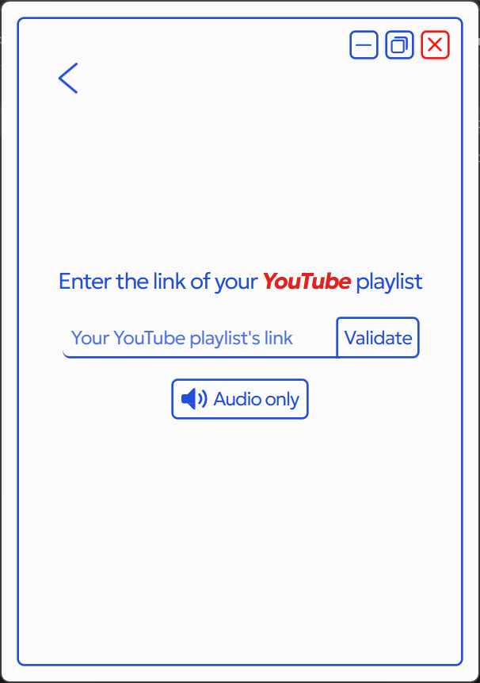

#### Options and Video resolutions

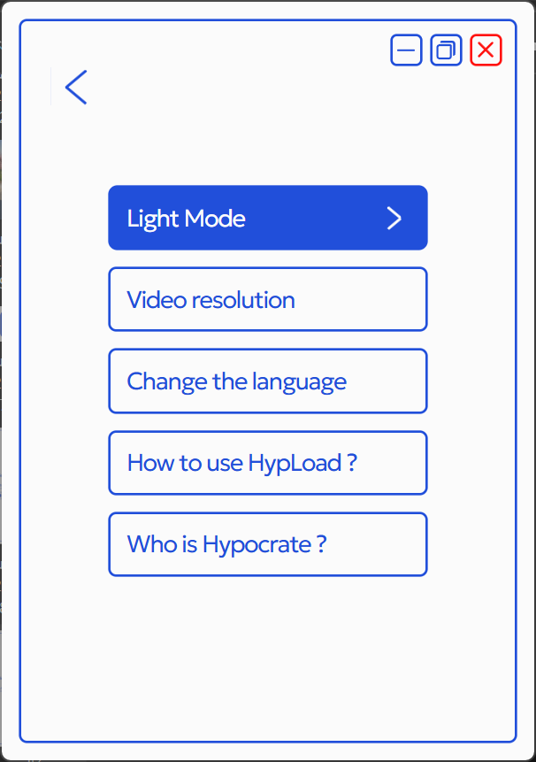
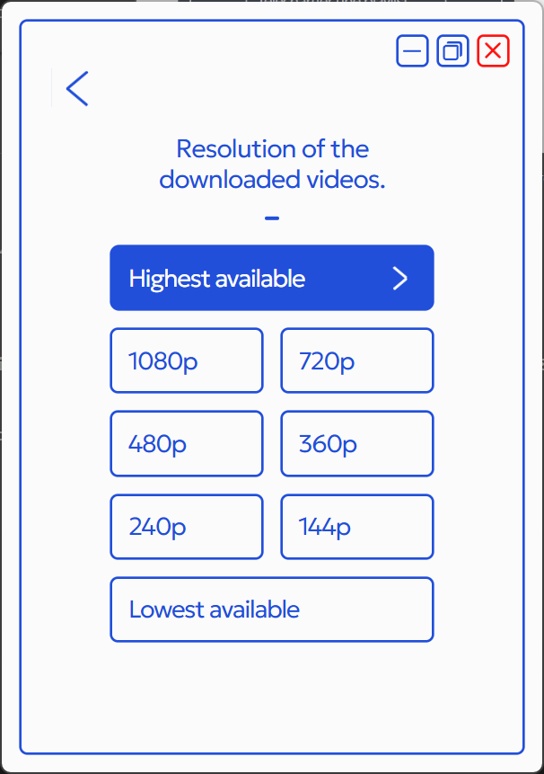

## <a id="en-credits">Credits</a>

This version of HypLoad uses the librairie [yt-dlp](https://github.com/yt-dlp/yt-dlp).
Thanks [lu'](https://instagram.com/jl.lucien) for the GIF appearing on Windows downloads, and social media visibility (video promotion and poster).

---

# <a id="fr">Version Française :</a>

**HypLoad** est un logiciel intelligent permettant de télécharger audio/video depuis YouTube, à partir de <u>vidéos</u> ou de <u>playlists</u>. Disponible sur Windows, macOS et Linux.

Sert d'interface pour [yt-dlp](https://github.com/yt-dlp/yt-dlp) (inclus).

> Hypload sera toujours gratuit, sans pub, ni création de compte, ni malware.

### Sommaire

- [Installation](#fr-installation)
   - [Windows](#fr-win)
   - [macOS](#fr-mac)
   <!-- - [Linux](#) -->
   - [Code source](#fr-source-code)
- [Fonctionnalités d'HypLoad](#fr-features)
   - [Télécharger une vidéo](#fr-download-video)
   - [Télécharger une playlist](#fr-download-playlist)
   - [Charger une playlist sauvegardée](#fr-load-playlist)
   - [Résolution des vidéos](#fr-resolution)
   - [Mise à jour HypLoad](#fr-update)
- [Dossiers de téléchargement](#fr-folders)
   - [Windows](#fr-win-folders)
   - [macOS](#fr-mac-folders)
- [Captures d'écran](#fr-screenshots)
- [Licence](LICENCE)

## <a id="fr-installation">Installation</a>

- [Windows](#fr-win)
- [macOS](#fr-mac)
- [Code source](#fr-source-code)

### <a id="fr-win">Windows</a>

1. Télécharger le fichier <a href="https://github.com/Hypocrate-code/HypLoad/raw/refs/heads/main/out/make/squirrel.windows/x64/HypLoad-1.0.0%20Setup.exe?download=">HypLoad-Setup.exe</a> de la dernière version.
2. Exécuter <u>HypLoad-Setup.exe</u> et accepter l'exécution (Informations supplémentaire -> exécuter quand même).
3. Utiliser HypLoad !

Les téléchargements se retrouveront dans [ces dossiers](#fr-folders).

Voir [Fonctionnalités](#fr-features)

### <a id="fr-mac">macOS</a>

1. Télécharger le dossier <a href="https://github.com/Hypocrate-code/HypLoad/raw/refs/heads/main/out/make/HypLoad-1.0.0-arm64.dmg?download=">.dmg</a> de la dernière version.
2. Exécuter le fichier <u>Hypload-x.x.x-arm64.dmg</u>.
3. Placer HypLoad dans le dossier */Applications*
4. Ouvrir un terminal et exécuter `sudo xattr -r -d com.apple.quarantine /Applications/HypLoad.app` pour autoriser HypLoad sur votre mac.
5. Utilisez HypLoad !

Les téléchargements se retrouveront dans [ces dossiers](#fr-folders).

Voir [Fonctionnalités](#fr-features)

### <a id="fr-source-code">Code source</a>

**Prérequis :** [Git](https://git-scm.com/), [Node.js](https://nodejs.org/fr) et [npm](https://www.npmjs.com/) doivent être installés sur votre PC.

1. `git clone https://github.com/Hypocrate-code/HypLoad`
2. `cd Hypload/`
3. `npm install`
4. Installez les executables correspondant à votre OS de [ffmpeg](https://ffmpeg.org/) et [yt-dlp](https://github.com/yt-dlp/yt-dlp?tab=readme-ov-file#release-files), puis placez les dans Hypload/bin/mac ou Hypload/bin/win.
5. `npm run start`

## <a id="fr-features">Fonctionnalités d'HypLoad</a>

- [Télécharger une vidéo](#fr-download-video)
- [Télécharger une playlist](#fr-download-playlist)
- [Charger une playlist sauvegardée](#fr-load-playlist)
- [Résolution des vidéos](#fr-resolution)
- [Mise à jour HypLoad](#fr-update)

### <a id="fr-download-video">Télécharger une vidéo</a>

1. Copiez le lien de votre vidéo YouTube (Partager + Copier).
2. Cliquez sur "Télécharger une vidéo" sur HypLoad et collez votre lien.
3. Vérifiez que l'option de téléchargement vous convient : "Audio uniquement" pour télécharger un mp3, ou "Audio et Vidéo" pour un mp4, sinon cliquez dessus.
4. Cliquez sur Télécharger.

Les téléchargements se retrouveront, s'il n'y a pas eu d'erreur, dans [ces dossiers](#fr-folders).

### <a id="fr-download-playlist">Télécharger une playlist</a>

Pour lancer le téléchargement d'une playlist entière :
1. Copiez le lien de votre playlist YouTube (Partager + Copier).
2. Cliquez sur "Télécharger une playlist" sur HypLoad et collez votre lien.
3. Vérifiez que l'option de téléchargement vous convient : "Audio uniquement" pour télécharger un mp3, ou "Audio et Vidéo" pour un mp4, sinon cliquez dessus.
4. Cliquez sur Valider.

Une fois la playlist chargée, chaque vidéo a une option Audio uniquement  ou Audio et Vidéo  ; ainsi qu'une case cochée  ou non , indiquant si la vidéo doit être téléchargée. Pour inverser une option, cliquez dessus.

Si la vidéo est déjà présente dans son [dossier de téléchargement](#fr-folders), sa case sera **par défaut décochée** pour vous éviter de la télécharger de nouveau.
Cela permet de télécharger ses playlists mises à jour sans avoir à faire de tri.

HypLoad enregistre les liens de vos playlists dans la section [Charger une playlist sauvegardée](#fr-load-playlist).

### <a id="fr-load-playlist">Charger une playlist sauvegardée</a>

HypLoad enregistre les liens de vos playlists pour que vous puissiez les recharger et ne télécharger que les nouvelles vidéos.
1. Cliquez sur "Mes playlists" sur HypLoad.
2. Si vous en avez déjà chargée, cliquez sur celle que vous voulez charger de nouveau.
3. Son lien est alors collé dans [Télécharger une playlist](#fr-download-playlist).

### <a id="fr-resolution">Résolution des vidéos</a>

L'option **Audio et Vidéo** téléchargera le son et les images de la vidéo en question.
Vous pouvez donc choisir la résolution que vous souhaitez télécharger dans "Options et infos" &rarr; "Résolutions des vidéos".

Vous avez le choix entre  :
- Plus haute disponible
- 1080p
- 720p
- 480p
- 360p
- 240p
- 144p
- Plus basse disponible

### <a id="fr-update">Mise à jour HypLoad</a>

L'algorithme de YouTube changeant régulièrement, HypLoad doit être également mis à jour. 
**La mise à jour automatique n'est pas encore activée**, si jamais HypLoad ne fonctionne plus, veuillez essayer avec [la dernière version disponible](https://github.com/Hypocrate-code/HypLoad/releases), ou le signaler.

## <a id="fr-folders">Dossiers de téléchargement</a>

- [Windows](#fr-win-folders)
- [macOS](#fr-mac-folders)

### <a id="fr-win-folders">Windows</a>

- Audio uniquement &rarr; dossier /HypLoad à l'adresse C:/Users/votreNom/Music/, soit **Win + R + "Music"**
- Audio et Vidéo &rarr; dossier /HypLoad à l'adresse C:/Users/votreNom/Videos/, soit **Win + R + "Videos"**

### <a id="fr-mac-folders">macOS</a>

- Audio uniquement &rarr; dossier /HypLoad à l'adresse votreNom/Musique/, soit **Finder + "Musique" (dossier avec l'îcone Note de musique)**
- Audio et Vidéo &rarr; dossier /HypLoad à l'adresse votreNom/Vidéos/, soit **Finder + "Vidéos" (dossier avec l'îcone Pellicule de film)**

## <a id="fr-screenshots">Captures d'écran</a>

#### Accueil mode Clair / Sombre

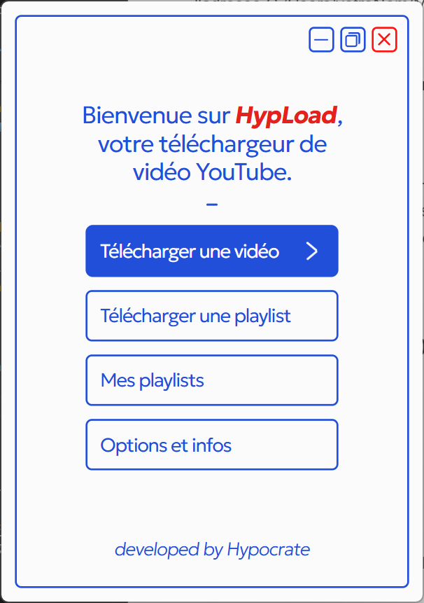
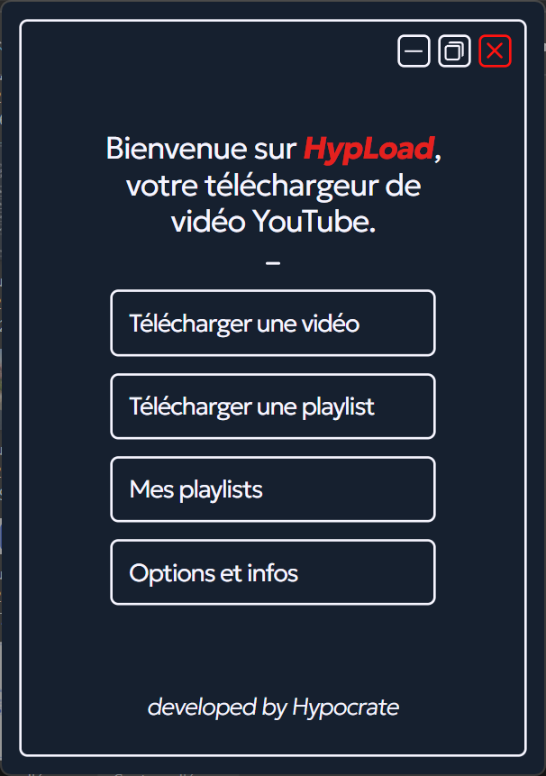

#### Télécharger une vidéo

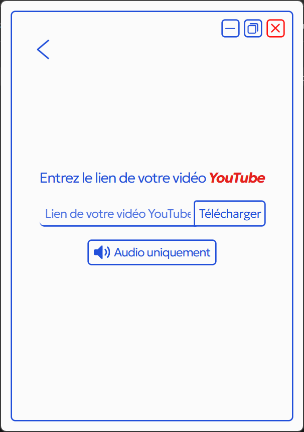

#### Télécharger une playlist

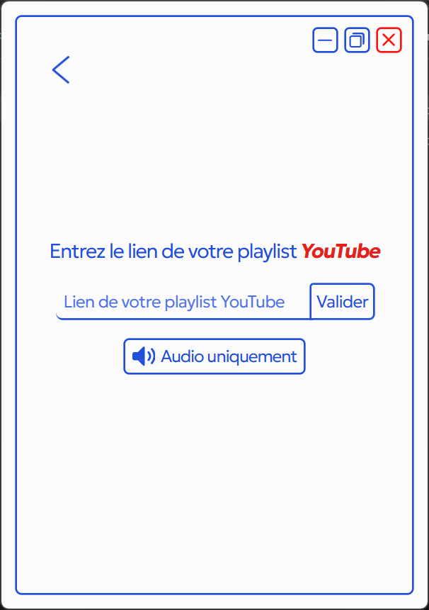

#### Options et Résolutions des vidéos

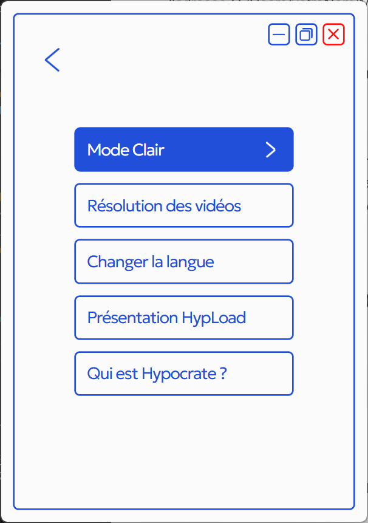
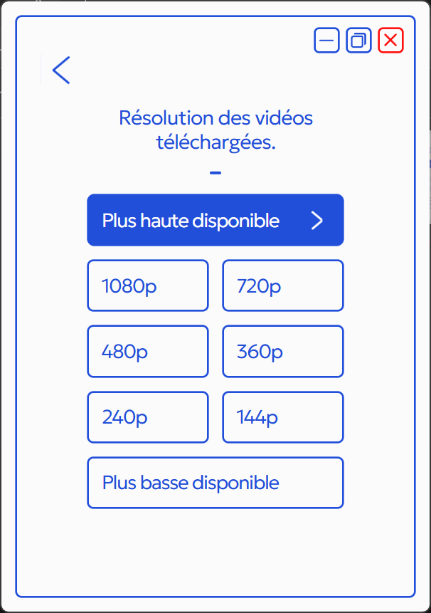

## <a id="fr-credits">Crédits</a>

Cette version de HypLoad utilise la librairie [yt-dlp](https://github.com/yt-dlp/yt-dlp).
Merci à [lu'](https://instagram.com/jl.lucien) pour le GIF lors de l'installation sur Windows, ainsi que pour la publication du projet (video publicité & affiche).

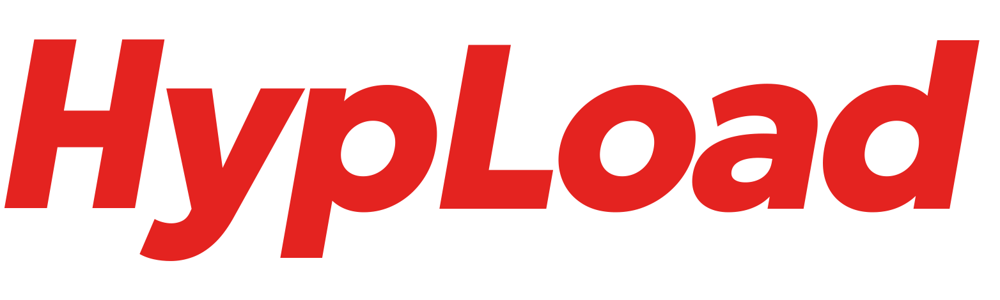
